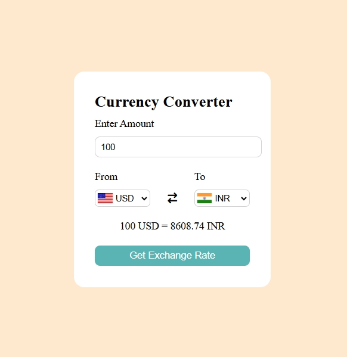

# 💱 Currency Converter Web App

A simple and interactive **Currency Converter** web application built using **HTML, CSS, and JavaScript**. It uses a free public API to convert values between different currencies in real time.

---

## ✨ Features

*  Convert between 100+ global currencies
*  Real-time exchange rates using `cdn.jsdelivr` API
*  Automatically update country flags on currency change
*  Swap "From" and "To" currencies easily
*  Simple and clean UI

---

##  Technologies Used

* HTML5
* CSS3
* JavaScript (ES6)
* [Fawaz Ahmed Currency API](https://github.com/fawazahmed0/currency-api)
* Flags from [flagsapi.com](https://flagsapi.com)

---

##  How to Run

1. Clone the repository:

   ```bash
   git clone https://github.com/shabrin786/currency-converter.git
   ```

2. Navigate to the project folder:

   ```bash
   cd currency-converter
   ```

3. Open `index.html` in your browser.

> No installation required — it runs directly in the browser!

---

##  Screenshot Preview




---

##  Author

**Shabirin Bano**
[GitHub Profile](https://github.com/shabrin786)

---

##  License

This project is open source and available for learning and educational purposes.
